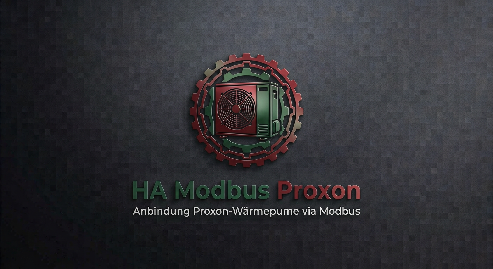

<p align="center">
  
</p>

# Proxon (FWT2.0) für Home Assistant

Home-Assistant-Integration für die Proxon-Wärmepumpe/Komfortlüftung **FWT2.0** über Modbus
TCP, nach dem seit 2026 empfohlenen ["modernisierten" Modbus-Architekturmuster von Home
Assistant](https://developers.home-assistant.io/blog/2026/07/05/modernizing-modbus/):
Register werden typisiert über [`modbus-connection`](https://home-assistant-libs.github.io/modbus-connection/)
modelliert, die physische Verbindung wird über HA-Cores eingebaute `modbus`-Integration
geteilt (kein eigener Socket), und alles wird über die Home-Assistant-Oberfläche (Config
Flow) eingerichtet – keine YAML-Bearbeitung mehr nötig.

Diese Integration ersetzt die bisherige, handgepflegte `proxon.yaml`
(`modbus:`-Plattform).

## Installation (HACS)

1. In HACS → Integrationen → ⋮ → *Benutzerdefinierte Repositories* → dieses Repository
   (`https://github.com/charly166/ha-modbus-proxon`) als Typ *Integration* hinzufügen.
2. "Proxon (FWT2.0)" installieren, Home Assistant neu starten.
3. Einstellungen → Geräte & Dienste → Integration hinzufügen → "Proxon" suchen.
4. Host/IP, Port (Standard `502`, an eurem Modbus-TCP-Gateway anpassen – z.B. `4196` wie
   in der bisherigen `proxon.yaml`) und Modbus-Slave-Adresse (Standard `41`) eingeben.

Die Integration hängt von Home Assistants eingebauter `modbus`-Integration ab
(`"dependencies": ["modbus"]` im Manifest) – die ist bereits Teil von Home Assistant Core,
dafür ist keine separate Installation nötig. Vorausgesetzt wird eine Home-Assistant-Version,
die `homeassistant.components.modbus.async_get_unit`/`async_get_temporary_unit` bereits
enthält (siehe oben verlinkter Blogpost); bei älteren Core-Versionen bitte zuerst
aktualisieren.

## Migration von der alten `proxon.yaml`

1. Den `modbus:`-Block (Inhalt von `proxon.yaml`) aus eurer Home-Assistant-Konfiguration
   entfernen und Home Assistant neu starten.
2. Diese Integration wie oben beschrieben über die UI einrichten.
3. **Entity-Kontinuität**: Für alle migrierten Entitäten wurden die exakt gleichen
   `unique_id`s und Anzeigenamen wie in der alten `proxon.yaml` übernommen. Solange sich
   daraus die gleiche `entity_id` ergibt (keine Namenskollision), läuft der Verlauf/die
   Statistik in Home Assistant nahtlos unter der gleichen `entity_id` weiter. Falls Home
   Assistant doch eine neue `entity_id` vergibt (z.B. weil die alte noch "besetzt" ist,
   solange die alte YAML-Config nicht restlos entfernt wurde), kann die neue Entität unter
   Einstellungen → Entitäten manuell auf die alte `entity_id` umbenannt werden, um den
   Verlauf zusammenzuführen.
4. Zwei kleine, durch den Abgleich mit der offiziellen Registerliste gefundene Korrekturen
   gegenüber der alten `proxon.yaml`:
   - `Proxon Standzeit FWT Gerätefilter` (Adresse 460): Die Registerliste weist die Einheit
     **Monate** aus, nicht Tage wie zuvor in der YAML vermerkt. Der Wert selbst ändert sich
     nicht, nur die angezeigte Einheit.
   - `Proxon Offsettemperatur Wohnzimmer` (Adresse 70): Laut Registerliste handelt es sich
     hierbei tatsächlich um die **"Soll Temperatur Zone 1 (EG)"** – technisch das gleiche
     Register, aber kein reiner Offset, sondern ein absoluter Sollwert. Der Entity-Name
     wurde unverändert gelassen, um bestehende Automatisierungen/Dashboards nicht zu
     brechen; der ursprüngliche Name/Kommentar aus der Registerliste steht als Kommentar in
     [`registers_holding.py`](custom_components/proxon/registers_holding.py).

## Umfang / Kuration der Register

Die vollständige Registerliste (`Modbus Liste FWT2.0 ver2 - für Kunden.xlsx`) umfasst 452
Holding- und 259 Input-Register. Diese Integration deckt einen **kuratierten, erweiterten**
Ausschnitt davon ab (254 Entitäten): alle bisher in `proxon.yaml` genutzten Register 1:1,
plus u.a. alle Betriebsstundenzähler, Bypass-Einstellungen, Gerätemodell/-typ, sowie den
gesamten "operativen" Input-Register-Block (Ventilatoren, Leistung/JAZ, Messtemperaturen
T1–T14, Ventilstellungen, Drücke, Heizmodul- und Bedienteil-Status).

Bewusst ausgelassen: PID-Regelparameter, Test-/Service-/Bedienteil-/Datum-&-Uhrzeit-Register,
die beiden Zeitprogramm-Blöcke (>100 Zeit-Slots) sowie rohe ADC-/Kalibrierregister und nicht
bestückte Bedienteil-Plätze (NBE7-19). Details und Begründung stehen als Kommentar am Anfang
von [`tools/generate_registers.py`](tools/generate_registers.py).

**Weitere Register selbst ergänzen**: `custom_components/proxon/registers_holding.py`,
`registers_input.py`, `model.py` sowie `sensor.py`/`switch.py`/`binary_sensor.py`/`number.py`
werden von `tools/generate_registers.py` erzeugt (nicht von Hand bearbeiten). Um weitere
Register aus der Excel-Liste zu ergänzen: die Ein-/Ausschlussregeln in
`extra_holding_addresses()` / `extra_input_addresses()` in diesem Skript anpassen und

```bash
pip install openpyxl pyyaml
python tools/generate_registers.py
```

im Projektverzeichnis erneut ausführen.

## Architektur-Hinweise

- **Ein Koordinator**: Statt der vielen unterschiedlichen `scan_interval`-Werte der alten
  YAML pollt eine einzelne `DataUpdateCoordinator`-Instanz alle Register einmal pro 15
  Sekunden (`UPDATE_INTERVAL_SECONDS` in `const.py`). `modbus-connection` fasst dabei pro
  Component benachbarte Register zu möglichst wenigen Leseanfragen zusammen.
- **Weicher Fehlerzustand**: Antwortet ein einzelner Registerblock nicht (Gerät kurz
  beschäftigt, Variante ohne bestimmtes Modul, ...), werden nur die betroffenen Entitäten
  `unavailable`, nicht die gesamte Integration – siehe `coordinator.py`/`entity.py`.
- **Schreibbare Register**: Alle Schalter (`switch.py`), die neuen Bypass-Einstellungen und
  die Zonen-Solltemperatur 2 (`number.py`) schreiben über
  `Component.write(field, value)` der `modbus-connection`-Bibliothek.

## Grenzen dieser Umsetzung

Diese Integration wurde in einer Umgebung ohne laufende Home-Assistant-Instanz und ohne
Zugriff auf die reale Proxon-Anlage entwickelt. Geprüft wurde:

- Python-Syntax aller Dateien (`py_compile`) und Lint (`ruff check`, sauber).
- Interne Konsistenz: jede Entity-Beschreibung referenziert ein tatsächlich vorhandenes
  `component`/`field`-Paar (automatisiert gegenprüft), alle 254 `unique_id`s sind eindeutig.
- Die Registeradressen/Skalierungen wurden 1:1 aus der mitgelieferten Excel-Liste bzw. der
  bisherigen `proxon.yaml` übernommen.

**Nicht** geprüft werden konnte ein echter Verbindungsaufbau zur Anlage oder das Laden in
einer laufenden Home-Assistant-Instanz. Bitte nach der Installation die Basisfunktionen
(Verbindungsaufbau im Config Flow, ein paar Sensor-Werte, ein Schalter) verifizieren, bevor
die alte `proxon.yaml`-Konfiguration endgültig gelöscht wird.
