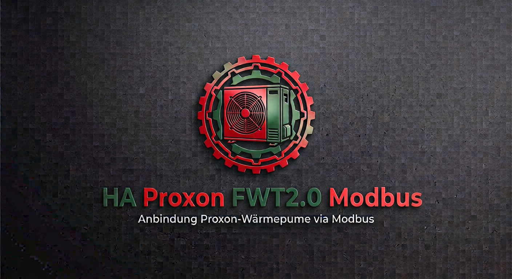

<p align="center">
  
</p>

# HA Proxon FWT 2.0 Modbus

Home-Assistant-Integration für die Proxon-Wärmepumpe/Komfortlüftung **FWT2.0** über Modbus
TCP, nach dem seit 2026 empfohlenen ["modernisierten" Modbus-Architekturmuster von Home
Assistant](https://developers.home-assistant.io/blog/2026/07/05/modernizing-modbus/):
Register werden typisiert über [`modbus-connection`](https://home-assistant-libs.github.io/modbus-connection/)
modelliert, und alles wird über die Home-Assistant-Oberfläche (Config Flow) eingerichtet –
keine YAML-Bearbeitung mehr nötig.

Diese Integration ist **nicht** auf eine bestimmte Anlage zugeschnitten: ein
Einrichtungs-Assistent fragt beim Setup ab, wie viele Bedienteile/Zonen tatsächlich installiert
sind (die FWT2.0 unterstützt architektonisch 1 ZBP + 1 HNBP + bis zu 19 NBP-Zonen), und legt
Entitäten dafür dynamisch an - unabhängig davon, wie viele Räume die konkrete Anlage hat.

Der im Blogpost beschriebene zweite Baustein – eine über Home Assistant Cores eingebaute
`modbus`-Integration geteilte Verbindung (`async_get_unit`/`async_get_temporary_unit`) – ist
in aktuellen, veröffentlichten Home-Assistant-Versionen noch nicht enthalten (Stand geprüft:
Home Assistant 2026.9.3; `homeassistant.components.modbus` hat diese Funktionen dort noch
nicht). Diese Integration öffnet deshalb aktuell eine **eigene** Modbus-TCP-Verbindung direkt
über `modbus-connection` (`modbus_connection.tmodbus.connect_tcp`), statt sie mit anderen
Integrationen zu teilen. Sobald HA Core die geteilte Verbindung veröffentlicht, kann darauf
umgestellt werden (betrifft nur `__init__.py`/`config_flow.py`, nicht das Registermodell).

Diese Integration ersetzt die bisherige, handgepflegte `proxon.yaml` (`modbus:`-Plattform)
**und** die darauf aufbauenden `climate_template`-Entitäten/Automatisierungen (siehe
`climates.yaml`/`automations.yaml`/`templates.yaml`/`controls.yaml` im Projektverzeichnis,
nur als Referenz mitgeliefert, nicht Teil dieses Repos) - die Heizungssteuerung pro Zone gibt
es jetzt nativ als `climate`-Entität, ganz ohne die HACS-Erweiterung
[hass-template-climate](https://github.com/jcwillox/hass-template-climate) und ohne
Sync-Automatisierungen.

## Icon/Logo in Home Assistant

Seit Home Assistant 2026.3 können Custom-Integrationen ihr Icon/Logo direkt mitbringen, ohne
einen Pull Request beim offiziellen [home-assistant/brands](https://github.com/home-assistant/brands)
zu benötigen (siehe [Brands-Proxy-API-Ankündigung](https://developers.home-assistant.io/blog/2026/02/24/brands-proxy-api)).
Dieses Repo enthält daher `custom_components/proxon/brand/` mit `icon.png`/`icon@2x.png`
(256×256/512×512, aus dem Logo-Zahnrad-Emblem zugeschnitten) und `logo.png`/`logo@2x.png`
(Querformat) - Home Assistant zeigt diese automatisch in der Integrationssuche, unter
Einstellungen → Geräte & Dienste und auf der Geräteseite an, sobald die Integration
installiert ist. Kein zusätzlicher Schritt nötig.

## Installation (HACS)

1. In HACS → Integrationen → ⋮ → *Benutzerdefinierte Repositories* → dieses Repository
   (`https://github.com/charly166/ha-modbus-proxon`) als Typ *Integration* hinzufügen.
2. "HA Proxon FWT 2.0 Modbus" installieren, Home Assistant neu starten.
3. Einstellungen → Geräte & Dienste → Integration hinzufügen → "Proxon" suchen.
4. **Schritt 1 - Verbindung**: Host/IP, Port (Standard `502`, an euer Modbus-TCP-Gateway
   anpassen) und Modbus-Slave-Adresse (Standard `41`) eingeben.
5. **Schritt 2 - Zonenanzahl**: Ist ein Hauptnebenbedienpanel (HNBP) installiert? Wie viele
   Nebenbedienpanel (NBP1..NBPx) gibt es?
6. **Schritt 3 - Raumnamen**: Ein Textfeld je Zone (ZBP, ggf. HNBP, dann NBP1, NBP2, ... in
   dieser Reihenfolge - die Reihenfolge entscheidet über die Registerzuordnung, siehe unten).

Die Integration verwaltet ihre Modbus-TCP-Verbindung selbst (siehe Hinweis oben); es ist also
keine weitere Voraussetzung an eure Home-Assistant-Version bezüglich der `modbus`-Integration
zu erfüllen. Benötigt wird lediglich Python ≥3.12 (durch `modbus-connection`), was jede
aktuelle Home-Assistant-Installation ohnehin mitbringt.

Zonenanzahl/-namen lassen sich später jederzeit über *Einstellungen → Geräte & Dienste →
Proxon → Neu konfigurieren* ändern (derselbe 3-Schritte-Assistent).

## Zonenmodell: ZBP / HNBP / NBPn

| Rolle | Menge | Besonderheit |
|---|---|---|
| **ZBP** (Zentralbedienpanel) | genau 1, immer vorhanden | Gibt die **absolute** Grundtemperatur fürs ganze Haus vor (10-30°C). Kein Tastensperre-/Mitteltemperatur-Register. |
| **HNBP** (Hauptnebenbedienpanel) | 0 oder 1 | Technisch wie eine NBP-Zone modelliert (Mitteltemperatur + ±3°C Offset). Seine gemessene Temperatur beeinflusst aber zusätzlich, ob die ZBP-Zieltemperatur fürs ganze Haus erreicht wird (Zone-1/Zone-2-Regelkreis der Anlage) - eine reine Fachinfo, keine Sonderlogik im Code. |
| **NBPn** (Nebenbedienpanel) | 0-19 | Zieltemperatur = eigene Mitteltemperatur (laufender Durchschnitt) ± bis zu 3°C Offset, per `number`/`climate` einstellbar. |

Jede Zone bekommt, je nach Rolle: `switch` (Heizelement; ZBP+HNBP+NBPn), `switch` (Tastensperre;
nur HNBP/NBPn), `sensor` (Ist-Temperatur; alle), `sensor` (Mitteltemperatur; nur HNBP/NBPn),
`number` (Soll-/Offset-Temperatur; alle) und eine `climate`-Entität (alle), die Ist-/
Zieltemperatur und Heizelement-Status/-Steuerung zu einer normalen Thermostat-Karte
zusammenfasst - **live berechnet bei jeder Aktualisierung**, ganz ohne die Sync-
Automatisierungen der alten Lösung.

## Migration von der alten `proxon.yaml` (+ climate_template-Setup)

1. Den `modbus:`-Block (Inhalt von `proxon.yaml`) sowie die `climate_template`-Entitäten aus
   `climates.yaml` und die zugehörigen Automatisierungen aus `automations.yaml` aus eurer
   Home-Assistant-Konfiguration entfernen, dann Home Assistant neu starten.
2. Diese Integration wie oben beschrieben über die UI einrichten.
3. **Für den ursprünglichen Anlagenbesitzer** (8 Zonen: Wohnzimmer als ZBP, Partykeller als
   HNBP, dann Flur/Schlafzimmer/**Buro**/Lea/Vorraum/Werkstatt als NBP1-NBP6 - **"Buro" ohne
   Umlaut eingeben**, weil die alte `proxon.yaml` die `unique_id`s manuell mit "buro" statt
   "büro" vergeben hatte, während diese Integration Umlaute intern zu "ue"/"oe"/"ae"
   transliteriert; "Büro" mit Umlaut würde stattdessen `..._buero` ergeben und eine neue,
   getrennte Entität anlegen) gilt: Werden im Assistenten exakt diese Namen in dieser
   Reihenfolge eingegeben, ergeben sich für alle migrierten Entitäten
   (Heizelement/Tastensperre/Ist-Temperatur) automatisch **dieselben** `unique_id`s wie zuvor
   (z.B. `switch.proxon_heizelement_wohnzimmer`) - der Verlauf läuft nahtlos weiter. Die
   neuen `number`/`climate`-Entitäten für die Zonen-Zieltemperatur sind davon unabhängig
   grundsätzlich neu (siehe nächster Punkt).
4. **Entity-Kontinuität, Details**: Für alle migrierten *zentralen* (nicht zonengebundenen)
   Entitäten wurden die exakt gleichen `unique_id`s und Anzeigenamen wie in der alten
   `proxon.yaml` übernommen. Solange sich daraus die gleiche `entity_id` ergibt, läuft der
   Verlauf nahtlos weiter; sonst kann die neue Entität unter Einstellungen → Entitäten
   manuell auf die alte `entity_id` umbenannt werden.
5. **Bewusste Brüche gegenüber der alten `proxon.yaml`** (alle mit Absicht, um native, sauber
   bedienbare Entitäten zu bekommen statt der alten Sensor+Helfer+Automatisierung-Behelfslösung):
   - `Proxon Betriebsart`, `Proxon Lüfterstufe`, `Proxon Soll-Temperatur Wasser` und
     `Proxon Heizstab Temperatur` waren Nur-Lese-Sensoren (mit `input_number`/`input_select`-
     Hilfsentitäten und Automatisierungen davor, weil die alte YAML-`modbus`-Integration keine
     `number`/`select`-Plattform kennt) - sie sind jetzt direkt schreibbare `select`- bzw.
     `number`-Entitäten. Die `input_number`/`input_select`-Helfer und die zugehörigen
     Sync-Automatisierungen aus `automations.yaml` werden nicht mehr gebraucht.
   - Die Zonen-Offset-/Solltemperatur (`Proxon Offsettemperatur <Raum>`) war ein Nur-Lese-
     Sensor, ist jetzt eine schreibbare `number`-Entität (und Teil der `climate`-Entität) -
     ersetzt die alte `climate_template` + `modbus.write_register`-Automatisierung.
   - `Proxon Ist-Temperatur 590` (ein unbenannter Duplikat-Sensor derselben physischen
     HNBP-Temperatur, die schon unter `Proxon Ist-Temperatur Partykeller` lief) entfällt -
     die neue, zonenbasierte Ist-Temperatur nutzt einheitlich die 590er-Registerreihe.
6. Zwei kleine, durch den Abgleich mit der offiziellen Registerliste gefundene Korrekturen:
   - `Proxon Standzeit FWT Gerätefilter` (Adresse 460): Einheit ist **Monate**, nicht Tage wie
     zuvor in der YAML vermerkt. Der Wert selbst ändert sich nicht, nur die Einheit.
   - `Proxon Ist-Temperatur Wasser` / `Proxon Temperatur Wasser Unten` (Adressen 813/814):
     Ein in der Registerliste zwischenzeitlich ergänzter T300-Abschnitt bestätigte den in der
     alten YAML verwendeten Rohwert-Offset (`offset: -100`) - dieser wurde bislang beim
     Generieren **nicht** übernommen (ein Fehler aus der ersten Version dieser Integration,
     v0.0.1/v0.0.2), wodurch beide Werte ca. 10°C zu hoch angezeigt wurden. Mit diesem Update
     korrekt.

## Umfang / Kuration der Register

Die vollständige Registerliste (`Modbus Liste FWT2.0 ver2 - für Kunden.xlsx`) umfasst über 450
Holding- und über 850 Input-Register (inkl. eines zwischenzeitlich ergänzten T300-Abschnitts).
Diese Integration deckt einen **kuratierten, erweiterten** Ausschnitt davon ab: alle bisher in
`proxon.yaml` genutzten *zentralen* Register 1:1, plus u.a. alle Betriebsstundenzähler,
Bypass-Einstellungen, Gerätemodell/-typ, den gesamten "operativen" Input-Register-Block
(Ventilatoren, Leistung/JAZ, Messtemperaturen T1–T14, Ventilstellungen, Drücke,
Heizmodul-Status) - sowie, dynamisch je nach Zonenanzahl, alle Zonen-Register (Heizelement,
Tastensperre, Ist-/Mittel-/Offset-Temperatur, Status).

Bewusst ausgelassen: PID-Regelparameter, Test-/Service-/Bedienteil-/Datum-&-Uhrzeit-Register,
die beiden Zeitprogramm-Blöcke (>100 Zeit-Slots), rohe ADC-/Kalibrierregister sowie der neue
T300-Abschnitt jenseits der schon zuvor genutzten 6 Warmwasser-Register (Solltemperatur,
Heizstab-Temperatur/-Status, Ist-Temperaturen, Kompressor-Status - die dortigen ~90 weiteren
Installateur-/Diagnoseregister folgen demselben Kurationsprinzip wie beim Hauptcontroller und
wurden nicht übernommen). Details und Begründung stehen als Kommentar am Anfang von
[`tools/generate_registers.py`](tools/generate_registers.py).

**Weitere (zentrale) Register selbst ergänzen**: `custom_components/proxon/registers_holding.py`,
`registers_input.py`, `model.py` sowie die Excel-kuratierten Teile von
`sensor.py`/`switch.py`/`binary_sensor.py`/`number.py` werden von `tools/generate_registers.py`
erzeugt (nicht von Hand bearbeiten - die Datei beginnt mit `AUTO-GENERATED`). Um weitere
Register zu ergänzen: die Ein-/Ausschlussregeln in `extra_holding_addresses()` /
`extra_input_addresses()` in diesem Skript anpassen und

```bash
pip install openpyxl pyyaml
python tools/generate_registers.py
ruff check --fix custom_components tools
```

im Projektverzeichnis erneut ausführen. Die Zonen-Register (`zones.py`, `climate.py`,
`select.py`) sind dagegen von Hand gepflegt, nicht generiert - sie hängen nicht von der
Excel-Kuration ab.

## Architektur-Hinweise

- **Ein Koordinator**: Statt der vielen unterschiedlichen `scan_interval`-Werte der alten
  YAML pollt eine einzelne `DataUpdateCoordinator`-Instanz alle Register einmal pro 15
  Sekunden (`UPDATE_INTERVAL_SECONDS` in `const.py`). `modbus-connection` fasst dabei pro
  Component benachbarte Register zu möglichst wenigen Leseanfragen zusammen.
- **Weicher Fehlerzustand**: Antwortet ein einzelner Registerblock nicht (Gerät kurz
  beschäftigt, Variante ohne bestimmtes Modul, ...), werden nur die betroffenen Entitäten
  `unavailable`, nicht die gesamte Integration – siehe `coordinator.py`/`entity.py`.
- **Dynamisches Zonenmodell**: `zones.py` nutzt `modbus_connection.model.repeating_group()`,
  um zur Laufzeit (abhängig von der im Config Flow gewählten Zonenanzahl) so viele
  `NbZone`/`NbZoneInput`-Instanzen zu erzeugen wie nötig - ein fester Adress-Versatz
  (`stride`) pro Zonenindex, kein Codegen pro Anlage.
- **Schreibbare Register**: Alle Schalter (`switch.py`), Bypass-Einstellungen,
  Betriebsart/Lüfterstufe/Wassertemperaturen sowie die Zonen-Solltemperaturen (`number.py`,
  `select.py`, `climate.py`) schreiben über `Component.write(field, value)` der
  `modbus-connection`-Bibliothek.

## Grenzen dieser Umsetzung

Diese Integration wurde ohne Zugriff auf die reale Proxon-Anlage und ohne laufende
Home-Assistant-Instanz entwickelt. Geprüft wurde dabei:

- Python-Syntax aller Dateien (`py_compile`) und Lint (`ruff check`, sauber).
- **Alle Python-Module wurden gegen die echten, per `pip install` bezogenen Pakete
  `modbus-connection==4.12.1` und `homeassistant==2026.9.3` importiert** (nicht nur
  Syntaxprüfung) – das deckt Tippfehler bei Funktions-/Klassennamen und falsche
  Import-Pfade zuverlässig auf.
- Die Register-Dekodierung (`model.py`/`registers_*.py`/`zones.py`) wurde end-to-end mit
  `modbus_connection.mock.MockModbusConnection` getestet: Werte schreiben → lesen → skalieren
  ergibt die erwarteten Ergebnisse, inklusive dynamischer Zonenanzahl (0, 1, mehrere Zonen)
  und Schreibpfaden (Schalter, Zahlenfelder).
- Die `climate`-Entität wurde ebenso end-to-end gegen eine simulierte Verbindung getestet:
  Ist-/Zieltemperatur-Berechnung für ZBP (absolut) und HNBP/NBPn (Mittel+Offset), Clamping am
  ±3°C-Limit, sowie die Schreibpfade für Zieltemperatur und Heizmodus.

**Nicht** geprüft werden konnte ein echter Verbindungsaufbau zur Anlage über das reale
Netzwerk/Gateway, das tatsächliche Laden in einer laufenden Home-Assistant-Instanz mit allen
Abhängigkeiten (Frontend-Übersetzungen, Geräte-Registry-Verhalten, der mehrstufige Config-Flow-
Assistent in der echten UI), oder das Verhalten mit mehr als der ursprünglich verifizierten
Zonenzahl auf echter Hardware. Bitte nach der Installation die Basisfunktionen
(Verbindungsaufbau im Assistenten, ein paar Sensor-Werte, ein Schalter, eine `climate`-Karte)
verifizieren, bevor die alte Konfiguration endgültig gelöscht wird.
