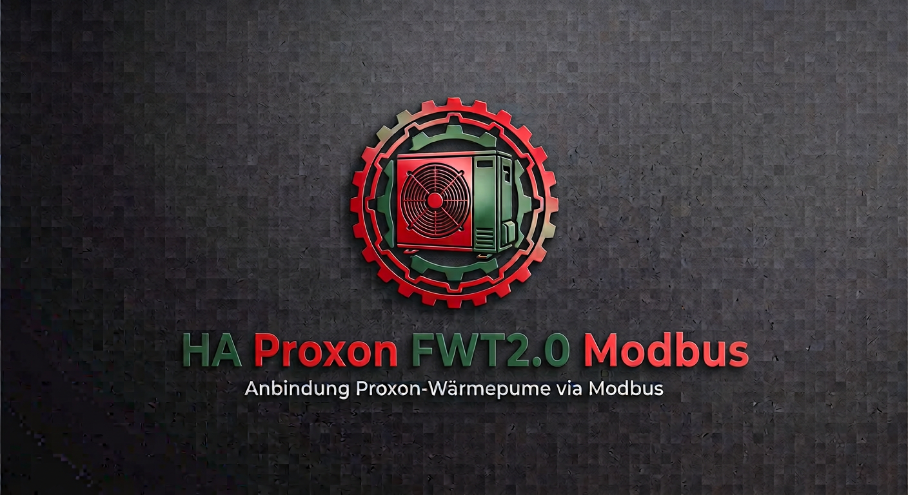

<p align="center">
  
</p>

# HA Proxon FWT 2.0 Modbus

Home-Assistant-Integration für die Proxon-Wärmepumpe/Komfortlüftung **FWT2.0** über Modbus
TCP, nach dem seit 2026 empfohlenen ["modernisierten" Modbus-Architekturmuster von Home
Assistant](https://developers.home-assistant.io/blog/2026/07/05/modernizing-modbus/):
Register werden typisiert über [`modbus-connection`](https://home-assistant-libs.github.io/modbus-connection/)
modelliert, und alles wird über die Home-Assistant-Oberfläche (Config Flow) eingerichtet –
keine YAML-Bearbeitung mehr nötig.

Diese Integration ist **nicht** auf eine bestimmte Anlage zugeschnitten: ein
Einrichtungs-Assistent fragt beim Setup ab, wie viele Bedienteile/Zonen tatsächlich installiert
sind (die FWT2.0 unterstützt architektonisch 1 ZBP + 1 HNBP + bis zu 19 NBP-Zonen), und legt
Entitäten dafür dynamisch an - unabhängig davon, wie viele Räume die konkrete Anlage hat.

Der im Blogpost beschriebene zweite Baustein – eine über Home Assistant Cores eingebaute
`modbus`-Integration geteilte Verbindung – wird seit Version 0.13.0 genutzt: Die Verbindung
kommt per `async_get_unit` (im Config-Flow `async_get_temporary_unit`) aus dem Kern. Dadurch
erscheint die Wärmepumpe im **Modbus-Panel** (Home Assistant 2026.10, Einstellungen →
Konnektivität), und mehrere Integrationen, die dasselbe Gerät ansprechen, teilen sich eine
Verbindung. Voraussetzung ist deshalb **Home Assistant 2026.9 oder neuer** (`hacs.json`); die
Integration hängt vom Kern-`modbus` ab (`dependencies` in `manifest.json`). Bis Version 0.12.x
öffnete sie eine eigene Verbindung, die im Panel nicht auftauchte.

Diese Integration ersetzt die bisherige, handgepflegte `proxon.yaml` (`modbus:`-Plattform)
**und** die darauf aufbauenden `climate_template`-Entitäten/Automatisierungen (siehe
`climates.yaml`/`automations.yaml`/`templates.yaml`/`controls.yaml` im Projektverzeichnis,
nur als Referenz mitgeliefert, nicht Teil dieses Repos) - die Heizungssteuerung pro Zone gibt
es jetzt nativ als `climate`-Entität, ganz ohne die HACS-Erweiterung
[hass-template-climate](https://github.com/jcwillox/hass-template-climate) und ohne
Sync-Automatisierungen.

## Icon/Logo in Home Assistant

Seit Home Assistant 2026.3 können Custom-Integrationen ihr Icon/Logo direkt mitbringen, ohne
einen Pull Request beim offiziellen [home-assistant/brands](https://github.com/home-assistant/brands)
zu benötigen (siehe [Brands-Proxy-API-Ankündigung](https://developers.home-assistant.io/blog/2026/02/24/brands-proxy-api)).
Dieses Repo enthält daher `custom_components/proxon/brand/` mit `icon.png`/`icon@2x.png`
(256×256/512×512, aus dem Logo-Zahnrad-Emblem zugeschnitten) und `logo.png`/`logo@2x.png`
(Querformat) - Home Assistant zeigt diese automatisch in der Integrationssuche, unter
Einstellungen → Geräte & Dienste und auf der Geräteseite an, sobald die Integration
installiert ist. Kein zusätzlicher Schritt nötig.

## Installation (HACS)

1. In HACS → Integrationen → ⋮ → *Benutzerdefinierte Repositories* → dieses Repository
   (`https://github.com/charly166/ha-modbus-proxon`) als Typ *Integration* hinzufügen.
2. "HA Proxon FWT 2.0 Modbus" installieren, Home Assistant neu starten.
3. Einstellungen → Geräte & Dienste → Integration hinzufügen → "Proxon" suchen.
4. **Schritt 1 - Verbindung**: Modbus Host/IP-Adresse, Modbus Port (Standard `502`, an euer
   Modbus-TCP-Gateway anpassen) und Modbus-Slave-Adresse (Standard `41`) eingeben.
5. **Schritt 2 - Zonenanzahl**: Ist ein Hauptnebenbedienpanel (HNBP) installiert? Wie viele
   Nebenbedienpanel (NBP1..NBPx) gibt es?
6. **Schritt 3 - Räume**: Für jede Zone (ZBP, ggf. HNBP, dann NBP1, NBP2, ... in dieser
   Reihenfolge - die Reihenfolge entscheidet über die Registerzuordnung, siehe unten) einen
   **Home-Assistant-Raum** aus einer Dropdown-Liste auswählen (nicht mehr frei eintippen).
   Existiert der Raum noch nicht, kann er direkt im Auswahlfeld neu angelegt werden.

Die Integration verwaltet ihre Modbus-TCP-Verbindung selbst (siehe Hinweis oben); es ist also
keine weitere Voraussetzung an eure Home-Assistant-Version bezüglich der `modbus`-Integration
zu erfüllen. Benötigt wird lediglich Python ≥3.12 (durch `modbus-connection`), was jede
aktuelle Home-Assistant-Installation ohnehin mitbringt.

Zonenanzahl/-namen lassen sich später jederzeit über *Einstellungen → Geräte & Dienste →
Proxon → Neu konfigurieren* ändern (derselbe 3-Schritte-Assistent).

## Zonenmodell: ZBP / HNBP / NBPn

| Rolle | Menge | Besonderheit |
|---|---|---|
| **ZBP** (Zentralbedienpanel) | genau 1, immer vorhanden | Gibt die **absolute** Grundtemperatur fürs ganze Haus vor (10-30°C). Kein Tastensperre-/Mitteltemperatur-Register. |
| **HNBP** (Hauptnebenbedienpanel) | 0 oder 1 | Technisch wie eine NBP-Zone modelliert (Mitteltemperatur + ±3°C Offset). Seine gemessene Temperatur beeinflusst aber zusätzlich, ob die ZBP-Zieltemperatur fürs ganze Haus erreicht wird (Zone-1/Zone-2-Regelkreis der Anlage) - eine reine Fachinfo, keine Sonderlogik im Code. |
| **NBPn** (Nebenbedienpanel) | 0-19 | Zieltemperatur = eigene Mitteltemperatur (laufender Durchschnitt) ± bis zu 3°C Offset, per `number`/`climate` einstellbar. |

Jede Zone bekommt, je nach Rolle: `switch` (Heizelement; ZBP+HNBP+NBPn - siehe aber Punkt 10
unter "Migration" zum Modbus-Schreibrecht für das ZBP-Heizelement), `binary_sensor` (Sperren
Bedienteil; nur HNBP/NBPn, lesbar - Grund siehe ebenda), `sensor` (Ist-Temperatur; alle),
`sensor` (Mitteltemperatur; nur HNBP/NBPn), `number` (Soll-/Offset-Temperatur; alle) und eine
`climate`-Entität (alle), die Ist-/Zieltemperatur und Heizelement-Status/-Steuerung zu einer
normalen Thermostat-Karte zusammenfasst - **live berechnet bei jeder Aktualisierung**, ganz
ohne die Sync-Automatisierungen der alten Lösung.

**Lücken in der NBP-Nummerierung sind erlaubt**: Manche Installationen haben z.B. NBP1-NBP3
und NBP5-NBP6, aber kein NBP4 (worden nachträglich entfernt, nie verbaut, o.ä.). Im
Einrichtungs-Assistenten bei "Höchste installierte NBP-Nummer" trotzdem die höchste
tatsächlich vorhandene Nummer eintragen (im Beispiel: 6) und im nächsten Schritt das
Raum-Feld der fehlenden Nummer (NBP4) einfach leer lassen - diese Zone wird dann
übersprungen (kein Gerät, keine Entitäten dafür), ihre Register werden zwar technisch
mitgelesen (sie liegen zwischen den vorhandenen NBPs), aber nirgends angezeigt.

## Geräte-Struktur

Jede Zone ist ihr **eigenes Gerät** in Home Assistant, benannt nach dem im Assistenten
gewählten Raum (z.B. "Büro", "Wohnzimmer") - nicht alles unter einem einzigen "Proxon"-Gerät.
Auch die am ZBP sitzenden Sensoren (Luftfeuchte und CO2 im Wohnzimmer, Register 22/21) gehören
zum ZBP-Gerät; ihre Entity-IDs bleiben dabei unverändert. Die Entitäten selbst tragen dadurch
nur noch ihre Funktion im Namen ("Ist-Temperatur",
"Offset-Temperatur", "Heizelement", "Sperren Bedienteil"); Home Assistant setzt den
Gerätenamen automatisch davor (z.B. "Büro Ist-Temperatur"). Die `climate`-Entität einer Zone
trägt gar keinen eigenen Namenszusatz - sie erscheint als Hauptentität direkt unter dem
Gerätenamen ("Büro").

Die **T300-Trinkwasserwärmepumpe** ist, obwohl kein per Raum-Auswahl konfigurierbarer "Zone",
ebenfalls ein **eigenes Gerät** ("T300") - nicht Teil des zentralen Geräts. Alle übrigen,
wirklich zentralen Register (Lüftung, Bypass, Betriebsstundenzähler, Diagnosewerte, ...)
bleiben gemeinsam unter dem zentralen Gerät (Titel der Integration).

Neu angelegte Zonen-Geräte werden zusätzlich dem gewählten Home-Assistant-Raum vorgeschlagen
(`suggested_area`), damit sie dort direkt einsortiert erscheinen.

Verringert man in "Neu konfigurieren" die Zahl der NBP (oder tauscht einen Raum aus), werden die
Geräte der nicht mehr konfigurierten Zonen beim nächsten Laden automatisch aus Home Assistant
entfernt; Geräte lösche ich nur, die zu dieser Integration gehören und keiner Zone mehr entsprechen.

## T300-Trinkwasserwärmepumpe

Der T300 (offiziell "Trinkwasserwärmepumpe", Modell T300) ist seit einem Update der
Registerliste vollständig dokumentiert. Das Gerät "T300"
bündelt jetzt:

- Die bereits zuvor migrierten 6 Entitäten (Soll-/Ist-Temperatur Wasser, Wasser Unten,
  Heizstab-Temperatur/-Schalter/-Status, Kompressor-Status).
- **Neu**: `select` "Betriebsart" (Aus/An),
  `number` "Filterwechselintervall T300" (Monate), `switch` "Legionellaschutz".
- **Neu**: ca. 80 Diagnose-Sensoren aus dem Kältekreis (Messtemperaturen T5/T6/T9/T11/T13,
  Drücke, Zustände, Fehlerzähler) sowie 3 zusätzliche Relais-Status (Solar/Ventilator/Abtau)
  als `binary_sensor`, alle als Diagnose-Entitäten (Kategorie "Diagnose", nicht im
  Standard-Dashboard sichtbar).

Wie beim Hauptcontroller bewusst ausgelassen: die zahlreichen Installateur-/PID-
Regelparameter und Datum/Uhrzeit-Register des T300-Abschnitts (z.B. `F-xx:Installateur Menü`,
`L-xx:LSC Menü`). Details/Adressen stehen als Kommentar in `tools/generate_registers.py`.

## Migration von der alten `proxon.yaml` (+ climate_template-Setup)

1. Den `modbus:`-Block (Inhalt von `proxon.yaml`) sowie die `climate_template`-Entitäten aus
   `climates.yaml` und die zugehörigen Automatisierungen aus `automations.yaml` aus eurer
   Home-Assistant-Konfiguration entfernen, dann Home Assistant neu starten.
2. Diese Integration wie oben beschrieben über die UI einrichten.
3. **Für den ursprünglichen Anlagenbesitzer** (8 Zonen: Wohnzimmer als ZBP, Partykeller als
   HNBP, dann Flur/Schlafzimmer/Büro/Lea/Vorraum/Werkstatt als NBP1-NBP6): Werden im
   Assistenten für jede Zone der jeweils **gleichnamige Home-Assistant-Raum** ausgewählt (in
   dieser Reihenfolge), ergeben sich für alle migrierten Entitäten
   (Heizelement/Sperren Bedienteil/Ist-Temperatur) in aller Regel **dieselben** `unique_id`s
   wie zuvor (z.B. `switch.proxon_heizelement_wohnzimmer`) - der Verlauf läuft nahtlos weiter.
   **Ausnahme Büro**: Falls euer Home-Assistant-Raum "Büro" mit Umlaut heißt, ergibt das
   `..._buero` statt des alten `..._buro` (die alte `proxon.yaml` hatte die `unique_id`s
   manuell ohne Umlaut vergeben, diese Integration transliteriert Umlaute zu "ue"/"oe"/"ae")
   - für exakte Kontinuität also entweder den Home-Assistant-Raum in "Buro" umbenennen, oder
   den einmaligen Entity-ID-Sprung für diese eine Zone in Kauf nehmen. Die neuen
   `number`/`climate`-Entitäten für die Zonen-Zieltemperatur sind davon unabhängig
   grundsätzlich neu (siehe nächster Punkt).
4. **Entity-Kontinuität, Details**: Für alle migrierten *zentralen* (nicht zonengebundenen)
   Entitäten wurden die exakt gleichen `unique_id`s und Anzeigenamen wie in der alten
   `proxon.yaml` übernommen. Solange sich daraus die gleiche `entity_id` ergibt, läuft der
   Verlauf nahtlos weiter; sonst kann die neue Entität unter Einstellungen → Entitäten
   manuell auf die alte `entity_id` umbenannt werden.
5. **Bewusste Brüche gegenüber der alten `proxon.yaml`** (alle mit Absicht, um native, sauber
   bedienbare Entitäten zu bekommen statt der alten Sensor+Helfer+Automatisierung-Behelfslösung):
   - `Proxon Betriebsart`, `Proxon Lüfterstufe`, `Proxon Soll-Temperatur Wasser` und
     `Proxon Heizstab Temperatur` waren Nur-Lese-Sensoren (mit `input_number`/`input_select`-
     Hilfsentitäten und Automatisierungen davor, weil die alte YAML-`modbus`-Integration keine
     `number`/`select`-Plattform kennt) - sie sind jetzt direkt schreibbare `select`- bzw.
     `number`-Entitäten. Die `input_number`/`input_select`-Helfer und die zugehörigen
     Sync-Automatisierungen aus `automations.yaml` werden nicht mehr gebraucht.
   - Die Zonen-Offset-/Solltemperatur (`Proxon Offsettemperatur <Raum>`) war ein Nur-Lese-
     Sensor, ist jetzt eine schreibbare `number`-Entität (und Teil der `climate`-Entität) -
     ersetzt die alte `climate_template` + `modbus.write_register`-Automatisierung.
   - `Proxon Ist-Temperatur 590` (ein unbenannter Duplikat-Sensor derselben physischen
     HNBP-Temperatur, die schon unter `Proxon Ist-Temperatur Partykeller` lief) entfällt -
     die neue, zonenbasierte Ist-Temperatur nutzt einheitlich die 590er-Registerreihe.
6. Zwei kleine, durch den Abgleich mit der offiziellen Registerliste gefundene Korrekturen:
   - `Proxon Standzeit FWT Gerätefilter` (Adresse 460): Einheit ist **Monate**, nicht Tage wie
     zuvor in der YAML vermerkt. Der Wert selbst ändert sich nicht, nur die Einheit.
   - `Proxon Ist-Temperatur Wasser` / `Proxon Temperatur Wasser Unten` (Adressen 813/814):
     Ein in der Registerliste zwischenzeitlich ergänzter T300-Abschnitt bestätigte den in der
     alten YAML verwendeten Rohwert-Offset (`offset: -100`) - dieser wurde bislang beim
     Generieren **nicht** übernommen (ein Fehler aus der ersten Version dieser Integration,
     v0.0.1/v0.0.2), wodurch beide Werte ca. 10°C zu hoch angezeigt wurden. Mit diesem Update
     korrekt.
7. **Betriebsart-Werte korrigiert**: Die Registerliste kommentiert Adresse 16 mit
   "0=Aus, 1=EcoSommer, 2=EcoWinter, 9=Test" - laut Rückmeldung vom eigenen Bedienpanel gilt
   tatsächlich 0=Aus, 1=Sommerbetrieb, 2=Winterbetrieb, 3=ECO Komfortbetrieb, 4=Ofenbetrieb.
   Die `select`-Entität "Proxon Betriebsart" nutzt jetzt diese korrigierten Werte.
8. **Gerätefilter-Sensoren gefixt**: `Proxon Standzeit FWT Gerätefilter` hatte
   `device_class: duration` zusammen mit der (korrekten) Einheit "Monate" - Home Assistant
   akzeptiert für diese Geräteklasse aber nur Sekunden/Minuten/Stunden/Millisekunden/
   Mikrosekunden/Tage, keine Monate, und protokollierte deswegen eine Warnung. Die
   Geräteklasse wurde entfernt (Einheit "Monate" bleibt). `Proxon Nutzzeit FWT Gerätefilter`
   hatte durch das Excel-Update zwischenzeitlich seine Einheit verloren (Registerliste lässt
   sie dort leer) - fällt jetzt korrekt auf "h" (Stunden) zurück.
9. **Neu: Gerätefilter-Restlaufzeit + Erinnerung** (ersetzt den bisherigen Template-Sensor aus
   `templates.yaml`): `sensor.proxon_geraetefilter_resttage` berechnet die verbleibenden Tage
   aus Standzeit (Monate × 30 Tage, Näherung) minus bisheriger Nutzzeit (Stunden ÷ 24) - live,
   ohne Template. `binary_sensor.proxon_geraetefilter_wechsel_faellig` schaltet auf "Ein",
   sobald die Restlaufzeit ≤ 14 Tage beträgt. Für die eigentliche Benachrichtigung (z.B. per
   Telegram) diesen Binärsensor in einer eigenen Automatisierung auslösen - die Integration
   versendet selbst keine Benachrichtigungen (HA-Konvention).
10. **Modbus-Schreibrecht-Konzept**: Die Anlage hat ein Rechtekonzept für Modbus-Schreibzugriffe,
    sichtbar in **Holding-Register 438** (`0 = kein Schreibzugriff`, `1 = einige Register`,
    `2 = alle Register` - in dieser Integration als schreibgeschützter Sensor
    **"Modbus Schreibrecht"** verfügbar). Bei Stufe 0 oder 1 lehnt die Anlage Schreibzugriffe auf
    bestimmte Register mit "Modbus Exception 0x03" ab. Die Registerliste dokumentiert **pro
    Register**, ab welcher Stufe es beschreibbar wird (Spalten D/E/F = Stufe 0/1/2); danach
    richtet sich, welche Entitäten dieser Integration schreibbar sind:
    - **`Sperren Bedienteil`** (alle Zonen) benötigt laut Registerliste Stufe 2 ("alle
      Register"). Die Integration liest das Schreibrecht bei **jedem Poll** mit und richtet die
      Entität danach aus: bei Stufe 2 ist es ein bedienbarer `switch`, bei Stufe 0/1 ein
      schreibgeschützter `binary_sensor`, der nur den Zustand anzeigt. Wird das Schreibrecht
      später hochgestuft (oder herabgesetzt), lädt sich die Integration von selbst neu und die
      Entität wechselt die Form - der Nutzer muss nichts einstellen. Ist das Schreibrecht nicht
      lesbar, bleibt es vorsichtshalber beim `binary_sensor`. Beide Varianten teilen sich die
      `unique_id`; die jeweils andere, verwaiste Variante wird dabei automatisch entfernt.
    - **`Heizelemente Global`** benötigt ebenfalls Stufe 2 und verhält sich genauso wie
      `Sperren Bedienteil`: bei Stufe 2 ein bedienbarer `switch`, sonst ein schreibgeschützter
      `binary_sensor` (gleiche `unique_id`, der Verlauf läuft weiter).
    - **Das Heizelement des ZBP** (Zentralbedienpanel, Adresse 187 - anders als bei
      HNBP/NBP1-19) benötigt ebenfalls Stufe 2, ist in dieser Version aber noch **regulär
      schreibbar** (Schalter + `climate`-Heizmodus) - ein Schreibversuch schlägt auf Anlagen mit
      Stufe 0/1 daher ebenfalls mit Exception 0x03 fehl. Das komplett read-only zu machen würde
      auch die `climate`-Entität des ZBP betreffen (Aus/Heizen-Umschaltung); vor dieser größeren
      Änderung bei Bedarf bitte ein Issue öffnen.
    - Alle übrigen schreibbaren Entitäten dieser Integration (Betriebsart, Lüfterstufe,
      Intensivlüftung, Zonen-Solltemperaturen, Heizelement HNBP/NBP1-19, T300-Einstellungen)
      benötigen laut Registerliste nur Stufe 1 und sollten auf den meisten Anlagen funktionieren.

    Die Berechtigungsstufe selbst lässt sich nicht aus Home Assistant heraus ändern, sondern nur
    über den [Proxon/Zimmermann-Kundenservice](https://www.zimmermann-lueftung.de/kundenservice).
    Nach dem Update die alte, jetzt verwaiste `switch.proxon_heizelemente_global`-Entität unter
    Einstellungen → Entitäten löschen; der neue `binary_sensor` behält dieselbe `unique_id`, der
    Verlauf läuft weiter.
11. **Stromaufnahme (`Proxon Stromaufnahme Total`, Input 25)**: hatte durch denselben
    Unit-Fallback-Fehler wie oben seine Einheit verloren (proxon.yaml dokumentierte "W", die
    Registerliste lässt die Einheit an dieser Adresse leer) - zeigte dadurch einen unbenannten
    Rohwert statt eines Leistungssensors. Jetzt korrekt als `device_class: power`, Einheit W.
12. **Neu: Heizelement-Status pro Zone** (`binary_sensor`, Diagnose-Kategorie): Der Heizelement-
    `switch` einer Zone schaltet nur die *Freigabe* frei ("darf bei Bedarf heizen"), nicht die
    Heizung selbst. Ob die PTC-Heizelemente gerade tatsächlich heizen, zeigt das **zentrale
    PTC-Modul** ("Heizmodul 1", Input 574): es hat **zehn Kanäle K1-K10** (Bit0 = K1 ... Bit9 =
    K10, im Stromverkabelungsplan als K1-K10 bezeichnet), und jeder Kanal versorgt ein bis drei
    PTCs **eines** Raums. Ein Raum kann mehrere Kanäle haben (z. B. das ZBP mit K1+K2), ein Kanal
    gehört aber immer nur zu einem Raum. Die Zuordnung Kanal → Raum folgt der Verkabelung des
    Installateurs und hat **keinen** Zusammenhang mit der NBP-Nummerierung; sie lässt sich nicht
    ableiten und wird im Einrichtungs-Assistenten in einem umrahmten Abschnitt pro Bedienpanel
    (Raum + Kanäle) per **Mehrfachauswahl K1-K10** angegeben (leer = kein Status-Sensor für diesen
    Raum; ein Kanal mehreren Räumen wird abgelehnt). Der Sensor ist an, solange mindestens einer
    der zugeordneten Kanäle aktiv ist; die Attribute `zugeordnete_kanaele`/`aktive_kanaele`
    zeigen die einzelnen Kanäle. Wer mit v0.7.0 eine einzelne Relais-Nummer eingetragen hatte,
    behält sie als zugeordneten Kanal.

    *So findet man die Zuordnung*: im Stromverkabelungsplan stehen die Kanäle K1-K10 am
    PTC-Modul und darunter die Räume (bei Bedarf handschriftlich ergänzt). Zusätzlich helfen die
    Betriebsstundenzähler "Stunden PTC Heizmodul 1 Relais n An": Kanäle desselben Raums laufen
    mit gleichen Stunden, ein unbenutzter Kanal bleibt bei 0 (an einer geprüften Anlage: K1 und
    K2 je 481 h = ZBP, K10 = 0 h). Beispiel dieser Anlage laut Plan: ZBP = K1+K2, NBP1 = K3,
    NBP2 = K4, NBP3 = K5, NBP4 = K6, NBP5 = K7, NBP6 = K8, HNBP = K9, K10 frei.

    **"Heizmodul 2"** (Input 583, `Proxon Heizelement Status 2`, "Stunden PTC Heizmodul 2 ...")
    sind dagegen die drei Heizstufen im Gerät selbst (typisch mehrere tausend Betriebsstunden auf
    drei Relais) und gehören **nicht** zu den Räumen; für den Raum-Status wird nur Input 574
    gelesen.
13. **Neu: Energieverbrauch für das Energie-Dashboard** (`sensor.*_energieverbrauch`, Wh,
    `device_class: energy`, `total_increasing`): Die Anlage liefert nur die Momentanleistung
    (Input 25). Dieser Sensor integriert sie nach dem Trapez-Verfahren zu einem stetig
    steigenden Zähler und stellt seinen Stand nach einem Neustart wieder her - es muss kein
    separater "Integral"-Helfer angelegt werden. Messlücken über 5 Minuten (Verbindungs-
    abbruch, Neustart) werden nicht hochgerechnet. Der Zähler beginnt bei 0 ab dem Zeitpunkt
    der Aktualisierung; ältere Verbräuche lassen sich daraus nicht rückwirkend ableiten.
14. **Entity-IDs aus dem Namen**: Frühe Versionen legten Entitäten an, bevor ihre Namen aufgelöst
    waren; Home Assistant vergab dafür Notfall-IDs wie `sensor.proxon`, `sensor.proxon_128` und
    behält sie dauerhaft. Beim Laden der Integration werden solche IDs jetzt einmalig nach dem
    Namen der Entität benannt: `sensor.proxon_128` (AbtauDruck) wird zu
    `sensor.proxon_abtaudruck`. Ist diese ID belegt (mehrere Entitäten mit demselben Namen),
    wird das Register angehängt - `sensor.proxon_t6_verdampfer_3x0213` (`3x` = Input-, `4x` =
    Holding-Register, vierstellige Adresse, wie in der Registerliste); nur ohne brauchbaren Namen
    bleibt allein das Register: `sensor.proxon_3x0209`. Neu angelegte zentrale Entitäten (nicht die
    der Räume, deren Gerätename den Raum enthält) bekommen von vornherein solche kurzen IDs
    statt der langen, aus dem Gerätenamen abgeleiteten. Bereits vergebene "richtige" IDs bleiben
    unangetastet; Dashboards/Automationen, die eine alte nummerierte ID verwenden, müssen
    angepasst werden (Verlaufsdaten wandern bei der Umbenennung mit).
    Dieselbe Migration entfernt auch Kollisionsnummern wie `sensor.proxon_aktueller_betrieb_2`,
    sobald die ID ohne Nummer wieder frei ist (z. B. nach dem Löschen verwaister Altentitäten).
15. **Textsensoren für Zahlen-Enums** (`device_class: enum`, nur lesbar), zusätzlich zu den
    unverändert bleibenden Rohwert-Sensoren: **Aktueller Betrieb (Text)** (Input 241: 0 =
    Lüftungsbetrieb, 1 = Heizbetrieb, 2 = Kühlbetrieb), **Geräte-Modell (Text)** (Holding 17:
    0 = FWT, 1 = P) und **Geräte-Typ (Text)** (Holding 18: 0 = Nur Heizen, 1 = Heizen und Kühlen;
    Modell und Typ als Diagnose-Entitäten). Ein Wert außerhalb dieser Zuordnung ergibt den
    Zustand "unbekannt".

16. **Geräteseite in Steuerung / Sensoren / Konfiguration / Diagnose gegliedert**: Home
    Assistant sortiert die Geräteseite nach der Entitätskategorie. Bisher landeten fast alle
    ~270 Sensoren pauschal in "Diagnose". Jetzt stehen die wichtigen Werte dort, wo man sie
    erwartet (Betriebsart, Lüfterstufe, Intensivlüftung, Kühlung → **Steuerung**; Temperaturen,
    Drehzahlen, Kompressor, Heizelement-Status, Stromaufnahme → **Sensoren**; Trinkwasser-Sollwerte,
    Legionellenschutz, Bypass-Einstellungen → **Konfiguration**; alles Technische bleibt in
    **Diagnose**). Die Zuordnung steht zentral in `presentation.py` (Tabelle) und gilt auch für die
    generierten Entitäten; Entity-IDs und Verlauf bleiben unverändert. Alle Entitäten haben
    außerdem passende MDI-Icons (explizit für die wichtigen, über Stichwortregeln für den Rest;
    der Aktuelle Betrieb und das 4-Wegeventil wechseln das Icon mit dem Zustand).
    Neu dazu: Binärsensoren **Bypass**, **Erdwärme**, **Magnetventil** (Diagnose) und
    **PTC-Relais aktiv** (an, sobald irgendein Kanal K1-K10 des PTC-Moduls schaltet), der
    Textsensor **4-Wegeventil** (Heizen/Kühlen) und der Diagnosesensor **Letzter
    Schreibfehler** (zeigt z. B. ein fehlendes Modbus-Schreibrecht, Register 438). Die
    Pseudo-Einheiten "AUS/AN" und "Binär" aus der Excel-Liste werden nicht mehr als
    Einheit angezeigt. Die Idee der Gliederung und die Icon-Wahl sind der MIT-lizenzierten
    Integration [Fummy1990/ha-lan-proxon](https://github.com/Fummy1990/ha-lan-proxon)
    nachempfunden (kein Code übernommen). Die T300 bleibt – anders als dort – ein eigenes Gerät.

17. **Rund 225 Sensoren sind standardmäßig deaktiviert**: Die Entitäten werden weiterhin
    angelegt, stehen aber in der Entitätsliste als "deaktiviert" und lassen sich dort jederzeit
    aktivieren (Zahnrad → "Aktiviert", danach die Integration neu laden). Die Liste
    (`DEFAULT_DISABLED` in `presentation.py`) stammt aus der Praxis: ständig schwankende
    Debug-Werte, Platzhalterwerte (nicht angeschlossene Fühler, `Clock*` immer 0), Rohwerte mit
    besserer Ersatz-Entität (Aktueller Betrieb, Bypass, 4-Wegeventil, ...), selten gebrauchte
    Funktionen (JAZ, Umluft, Wp-Timer) sowie Betriebsstunden, Fehlerzähler/-status und
    Kältekreis-Interna. Sichtbar bleiben u. a. Temperaturen, Drehzahlen, Stromaufnahme,
    Kompressorleistung, Störung, Fehlerliste, Firmware, Filterwerte und Heizelement-/PTC-Status.
    Das entlastet Recorder und Entitätsliste; der Modbus-Verkehr bleibt gleich, da jeder
    Register-Block weiterhin gelesen wird. Das gilt nur für neu angelegte Entitäten - bestehende
    Installationen behalten ihren aktuellen Zustand. Wer z. B. die Fehlerwerte
    (`ErrorStatus1-4`, `FU_ErrorCode`) oder die Betriebsstunden braucht, aktiviert sie einfach.

## Umfang / Kuration der Register

Die vollständige Registerliste (`Modbus Liste FWT2.0 ver2 - für Kunden.xlsx`) umfasst über 450
Holding- und über 850 Input-Register (inkl. eines zwischenzeitlich ergänzten T300-Abschnitts).
Diese Integration deckt einen **kuratierten, erweiterten** Ausschnitt davon ab: alle bisher in
`proxon.yaml` genutzten *zentralen* Register 1:1, plus u.a. alle Betriebsstundenzähler,
Bypass-Einstellungen, Gerätemodell/-typ, den gesamten "operativen" Input-Register-Block
(Ventilatoren, Leistung/JAZ, Messtemperaturen T1–T14, Ventilstellungen, Drücke,
Heizmodul-Status) - sowie, dynamisch je nach Zonenanzahl, alle Zonen-Register (Heizelement,
Tastensperre, Ist-/Mittel-/Offset-Temperatur, Status).

Bewusst ausgelassen: PID-Regelparameter, Test-/Service-/Bedienteil-/Datum-&-Uhrzeit-Register,
die beiden Zeitprogramm-Blöcke (>100 Zeit-Slots), rohe ADC-/Kalibrierregister sowie - beim
T300-Abschnitt - die zahlreichen Installateur-/PID-Regel-/Datum-Uhrzeit-Register (siehe
Abschnitt "T300-Trinkwasserwärmepumpe" oben für das, was dort *wurde* übernommen). Details und
Begründung stehen als Kommentar am Anfang von
[`tools/generate_registers.py`](tools/generate_registers.py).

**Weitere (zentrale) Register selbst ergänzen**: `custom_components/proxon/registers_holding.py`,
`registers_input.py`, `model.py` sowie die Excel-kuratierten Teile von
`sensor.py`/`switch.py`/`binary_sensor.py`/`number.py` werden von `tools/generate_registers.py`
erzeugt (nicht von Hand bearbeiten - die Datei beginnt mit `AUTO-GENERATED`). Um weitere
Register zu ergänzen: die Ein-/Ausschlussregeln in `extra_holding_addresses()` /
`extra_input_addresses()` in diesem Skript anpassen und

```bash
pip install openpyxl pyyaml
python tools/generate_registers.py
ruff check --fix custom_components tools
```

im Projektverzeichnis erneut ausführen. Die Zonen-Register (`zones.py`, `climate.py`,
`select.py`) sind dagegen von Hand gepflegt, nicht generiert - sie hängen nicht von der
Excel-Kuration ab.

## Architektur-Hinweise

- **Ein Koordinator**: Statt der vielen unterschiedlichen `scan_interval`-Werte der alten
  YAML pollt eine einzelne `DataUpdateCoordinator`-Instanz alle Register einmal pro 15
  Sekunden (`UPDATE_INTERVAL_SECONDS` in `const.py`). `modbus-connection` fasst dabei pro
  Component benachbarte Register zu möglichst wenigen Leseanfragen zusammen.
- **Weicher Fehlerzustand**: Antwortet ein einzelner Registerblock nicht (Gerät kurz
  beschäftigt, Variante ohne bestimmtes Modul, ...), werden nur die betroffenen Entitäten
  `unavailable`, nicht die gesamte Integration – siehe `coordinator.py`/`entity.py`.
- **Dynamisches Zonenmodell**: `zones.py` nutzt `modbus_connection.model.repeating_group()`,
  um zur Laufzeit (abhängig von der im Config Flow gewählten Zonenanzahl) so viele
  `NbZone`/`NbZoneInput`-Instanzen zu erzeugen wie nötig - ein fester Adress-Versatz
  (`stride`) pro Zonenindex, kein Codegen pro Anlage.
- **Schreibbare Register**: Alle Schalter (`switch.py`), Bypass-Einstellungen,
  Betriebsart/Lüfterstufe/Wassertemperaturen sowie die Zonen-Solltemperaturen (`number.py`,
  `select.py`, `climate.py`) schreiben über `Component.write(field, value)` der
  `modbus-connection`-Bibliothek.

## Grenzen dieser Umsetzung

Diese Integration wurde ohne Zugriff auf die reale Proxon-Anlage und ohne laufende
Home-Assistant-Instanz entwickelt. Geprüft wurde dabei:

- Python-Syntax aller Dateien (`py_compile`) und Lint (`ruff check`, sauber).
- **Alle Python-Module wurden gegen die echten, per `pip install` bezogenen Pakete
  `modbus-connection==4.12.1` und `homeassistant==2026.9.3` importiert** (nicht nur
  Syntaxprüfung) – das deckt Tippfehler bei Funktions-/Klassennamen und falsche
  Import-Pfade zuverlässig auf.
- Die Register-Dekodierung (`model.py`/`registers_*.py`/`zones.py`) wurde end-to-end mit
  `modbus_connection.mock.MockModbusConnection` getestet: Werte schreiben → lesen → skalieren
  ergibt die erwarteten Ergebnisse, inklusive dynamischer Zonenanzahl (0, 1, mehrere Zonen)
  und Schreibpfaden (Schalter, Zahlenfelder).
- Die `climate`-Entität wurde ebenso end-to-end gegen eine simulierte Verbindung getestet:
  Ist-/Zieltemperatur-Berechnung für ZBP (absolut) und HNBP/NBPn (Mittel+Offset), Clamping am
  ±3°C-Limit, sowie die Schreibpfade für Zieltemperatur und Heizmodus.

**Nicht** geprüft werden konnte ein echter Verbindungsaufbau zur Anlage über das reale
Netzwerk/Gateway, das tatsächliche Laden in einer laufenden Home-Assistant-Instanz mit allen
Abhängigkeiten (Frontend-Übersetzungen, Geräte-Registry-Verhalten, der mehrstufige Config-Flow-
Assistent in der echten UI), oder das Verhalten mit mehr als der ursprünglich verifizierten
Zonenzahl auf echter Hardware. Bitte nach der Installation die Basisfunktionen
(Verbindungsaufbau im Assistenten, ein paar Sensor-Werte, ein Schalter, eine `climate`-Karte)
verifizieren, bevor die alte Konfiguration endgültig gelöscht wird.

**Bekannte Klasse von Fehlern, die sich so nicht vorab erkennen lässt**: `modbus-connection`
fasst mehrere Felder eines Components automatisch zu einem einzigen Leseblock zusammen, wenn
sie nah genug beieinander liegen (`Component.max_gap`, Standard 16 Register). Das ist korrekt,
solange auch die Register *zwischen* den beiden Feldern auf der Anlage existieren – ist das
nicht der Fall, lehnt die reale Hardware den zusammengefassten Lesevorgang mit "Illegal Data
Address" (Modbus Exception Code 2) ab, obwohl beide Einzelregister für sich valide sind. Dieser
Fehler tritt ausschließlich am echten Gerät auf (der Mock kennt nur die tatsächlich
beschriebenen Register, nicht deren "Lücken"), wurde bei `Geraetefilter`
(Standzeit/Nutzzeit, Register 460/469) durch Live-Debug-Logging gegen die Anlage des
Integrations-Autors entdeckt und dort mit `max_gap = 0` (erzwingt getrennte Lesevorgänge)
behoben. Sollten weitere Sensoren dauerhaft `Nicht verfügbar` bleiben, bitte das
Debug-Protokoll der Integration aktivieren (⋮ am Integrationseintrag → "Debug-Protokoll
aktivieren", danach in den Protokollen "Unveränderte Protokolle anzeigen" für die
DEBUG-Zeilen) und nach `Modbus exception code 2` suchen – das identifiziert das betroffene
Component eindeutig.
